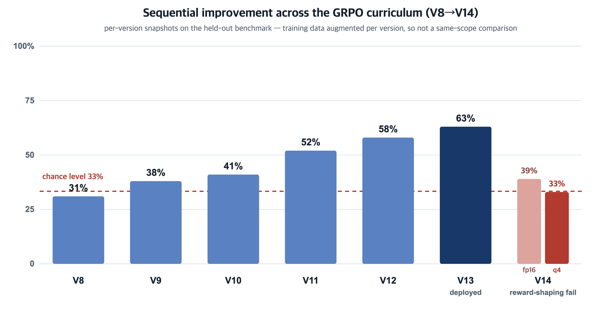

# Edge-Deployed LLM for Multi-Modal IoT Sensor Anomaly Detection

> **MIRU 2026 · Track B (Poster)** — The 29th Meeting on Image Recognition and Understanding, Nagasaki, Japan, Aug 3–6, 2026
> YoungWook Park · Siah Kim · Zepa Yang — Dept. of Computer Science & Engineering, Soonchunhyang University · Efficient Computing Lab

A fully on-premises pipeline that puts a **GRPO fine-tuned Qwen2.5-3B** on a **Jetson Orin Nano (8 GB)** to read four heterogeneous sensor streams in natural language and output a three-class safety state — `steady / monitoring / emergency` — in **2.3 s median end-to-end**, with no cloud dependency.

  

## Highlights

| Metric | Value | Eval cohort |
|---|---|---|
| LLM-only accuracy (deployed V13) | **63%** (21/33) | held-out benchmark, disjoint from training |
| System-level accuracy (LLM + rule backstop) | **100%** | same benchmark, after backstop (~8% overrides) |
| Quantization cost (fp16 → q4f16_1) | **−6 pp** (39% → 33%) | controlled pair: same V14 checkpoint, same benchmark |
| Compression | **3.8×** (6.2 GB → 1.617 GB) | fits Jetson Orin Nano 8 GB unified memory |
| End-to-end latency | **2.3 s median** (5 s SLA) | 100-trial live run |

## Why an LLM, not another threshold controller?

Single-value thresholds or pattern-based control curves can only switch a cleansing process on/off — they cannot reason about what that intervention does to the *other* modalities. Here the LLM judges all four sensor streams **jointly**, so the effect of an evacuation/cleansing action (e.g., ventilation lowering VOC while shifting temperature and humidity) can enter the safety judgment itself. This deployment is a pilot of **system homeostasis maintenance**, not a threshold replacement.

## System architecture

  

1. **Sensor acquisition** — Raspberry Pi 5 polls DHT22 (temp/humidity), MPU-6050 (vibration RMS), MQ-135 (VOC), ACS712-30A (current) and posts one 5-field JSON payload per cycle.
2. **Inference gateway** — FastAPI on Jetson bridges sensor JSON into the model's prompt distribution.
3. **LLM inference** — Qwen2.5-3B-Instruct, GRPO fine-tuned, compiled to q4f16_1 (1.617 GB) via MLC-LLM/Apache TVM, 1.2–1.8 s per call on the Jetson GPU.
4. **Rule-based safety backstop** — four hard thresholds (temp>80 °C, current>25 A, vibration>2.5 g, VOC>500 ppm) enforced over any LLM output; results persisted to SQLite for audit/retraining.

## GRPO training curriculum (V8 → V14)

  

- Synthetic training scenarios spanning 3 modes and 4 emergency subtypes, augmented per version (200 → 2,000 samples) — bars show **sequential curriculum improvement**, not a same-scope comparison.
- Reward: +1.0 correct mode, −1.0 wrong mode, −2.0 malformed JSON (TRL v0.13, single NVIDIA L40).
- **V14 mode collapse**: escalating one wrong-class penalty to −1.5 (asymmetric reward shaping) collapsed 21/22 failures into a single low-penalty class (33%). Lesson: **keep GRPO reward magnitudes symmetric across error types — fix class imbalance in the data, not the reward.**
- V14 doubled as a **controlled quantization benchmark**: same checkpoint, same benchmark, fp16 39% → q4f16_1 33% = a measured −6 pp deployment tax for 3.8× compression.

## Per-class behavior (deployed V13, q4f16_1)

| Class | Precision | Recall | Notes |
|---|---|---|---|
| steady | 0.81 | 0.74 | most distinctive sensor profile |
| monitoring | 0.41 | 0.53 | ambiguous boundary with steady |
| emergency | 0.72 | 0.78 | hard thresholds aid detection |

## Stack

`Raspberry Pi 5` · `Jetson Orin Nano 8 GB` · `Qwen2.5-3B-Instruct` · `GRPO (TRL)` · `MLC-LLM / Apache TVM (q4f16_1)` · `FastAPI` · `SQLite`

## Publication

Presented as a poster at **MIRU 2026** (Track B, Interactive Session), Nagasaki, Japan, August 3–6, 2026.
The extended abstract is not redistributed here in accordance with MIRU's confidentiality policy.

## Limitations & next steps

37% LLM-only error rate (backstop-dependent for safety-critical use), synthetic-only training data, stateless inference. Next: sliding-window sensor history in-prompt, larger 7B quantized bases, and closing the homeostasis loop with actuation feedback.
