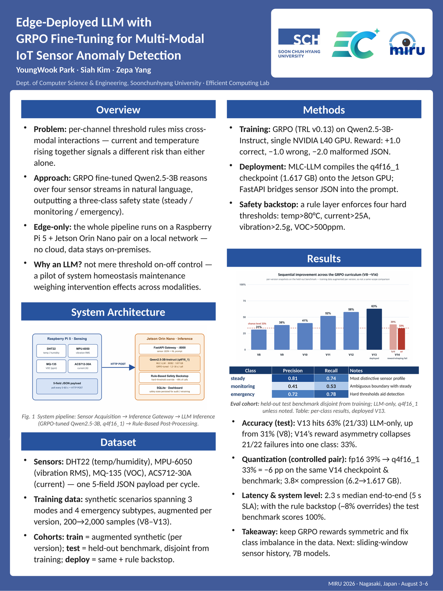
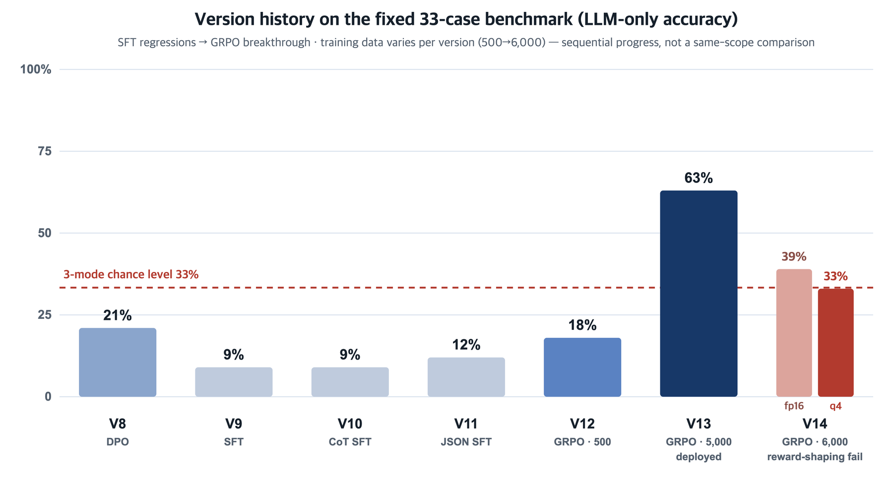
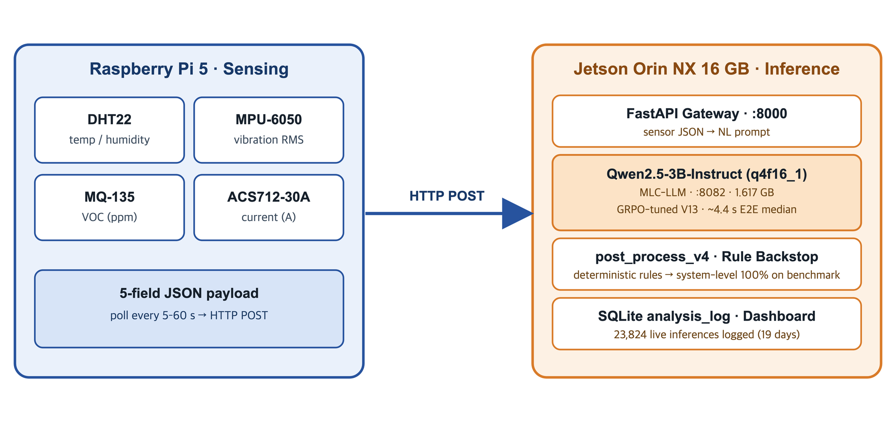

# Edge-Deployed LLM for Multi-Modal IoT Sensor Anomaly Detection

> **MIRU 2026 · Track B (Poster)** — The 29th Meeting on Image Recognition and Understanding, Nagasaki, Japan, Aug 3–6, 2026
> YoungWook Park · Siah Kim · Zepa Yang — Dept. of Computer Science & Engineering, Soonchunhyang University · Efficient Computing Lab

A fully on-premises pipeline: a **GRPO fine-tuned Qwen2.5-3B** running on a **Jetson Orin NX (16 GB)** reads four heterogeneous sensor streams in natural language and outputs a structured safety judgment — `{mode, action, level, reason}` — which a deterministic rule layer (`post_process_v4`) then verifies. No cloud dependency; every inference is logged to SQLite on-device.

All numbers below come from the lab's version-history record (`MODEL_HISTORY.md`) and the on-device production database, re-verified directly on the running system on 2026-07-26.

  

## Measured results

| Metric | Value | Source / cohort |
|---|---|---|
| LLM-only accuracy (deployed V13) | **63%** (21/33) | fixed 33-case benchmark (`compare_v8.py`), disjoint from training |
| System-level accuracy (LLM + rule backstop) | **100%** | same benchmark, after `post_process_v4` |
| Quantization cost (fp16 → q4f16_1) | **−6 pp** (39% → 33%) | controlled pair: same V14 checkpoint, same benchmark |
| Model footprint | **1.617 GB** (q4f16_1, MLC) | vs ~6.2 GB fp16 — 3.8× compression |
| Live deployment | **23,824 inferences / 19 days** | production DB (`analysis_log`), 2026-05-23 → 06-11 |
| End-to-end latency (live) | **median 4.4 s** · avg 4.9 s · p95 7.5 s | measured per-inference in the production DB |

## The training journey (this is the interesting part)

  

Seven model versions, three training paradigms, one clear lesson:

| Ver. | Method | Data | LLM-only | System | Note |
|---|---|---|---|---|---|
| V8 | DPO (on V7 SFT) | – | 21% (7/33) | 100% | best pre-GRPO |
| V9 | SFT from scratch | 5,000 | 9% | 100% | regression |
| V10 | CoT SFT (LR 5e-7) | 5,000 | 9% | 100% | CoT didn't help |
| V11 | Direct-JSON SFT (LR 2e-6) | 5,000 | 12% | 96% | SFT ceiling confirmed |
| V12 | GRPO, 500 samples (from V8 LoRA) | 500 | 18% | 100% | signal confirmed |
| **V13** | **GRPO, 5,000 balanced (from V12 LoRA)** | 5,000 | **63% (21/33)** | **100%** | **deployed** |
| V14 | GRPO + asymmetric reward shaping (from base) | 6,000 | 39% fp16 / 33% q4 | 100% | mode collapse — discarded |

- **Why SFT failed (V9–V11)**: token-level cross-entropy weights every token equally — strong at learning explanation prose, weak at the single `action` token that actually matters. Few-shot examples in the system prompt didn't help either (V11).
- **Why GRPO worked**: the reward hits the action decision directly (+1.0 correct, −1.0 wrong, −2.0 malformed JSON). V13 training: LR 2e-5, 1 epoch, num_generations=4, max_completion_length=80, cosine scheduler — **6 h 52 m on a single NVIDIA L40** (~5 s/step), a 3× jump over the previous best.
- **V14 mode collapse**: to fix V13's caution-overprediction (5 of its 12 failures), the wrong-`caution` penalty was raised to −1.5 while others stayed at −1.0. The policy escaped to the lowest-penalty answer instead: **21 of 22 failures answered `none`** — including obvious emergencies (current 1.8 A, VOC 1200). GRPO's group-relative baseline accelerates this drift. **Keep reward magnitudes symmetric; fix class imbalance in the data, not the reward.**
- V14 was salvaged as a **controlled quantization benchmark**: same checkpoint, same 33 cases — fp16 39% vs q4f16_1 33% = a measured −6 pp quantization tax.

## What the model actually decides

Output is a JSON judgment over five sensor values (temperature, humidity, VOC, current, vibration RMS):

- **steady** → `none` · `open_window` (26–28 °C) · `close_window` (<15 °C) · `air_purifier_on` (VOC 400–700) · `dehumidifier_on` (humidity >75%)
- **monitoring** → `caution` (28–30 °C, current 1.3–1.7 A, vibration 0.05–0.08 g, VOC 700–1,000)
- **emergency** → `overheat` (>30 °C) · `electrical` (>1.7 A) · `vibration` (>0.08 g) · `air_quality` (VOC >1,000)

The 33-case benchmark covers every action class plus exact boundary values (26.0 °C, 30.0 °C, 1.3 A, 0.05 g, …).

## System architecture

  

1. **Sensor acquisition** — Raspberry Pi 5 polls DHT22 (temp/humidity), MPU-6050 (vibration RMS), MQ-135 (VOC), ACS712-30A (current); one 5-field JSON payload per cycle.
2. **Inference gateway** — FastAPI on the Jetson turns sensor JSON into the model's prompt.
3. **LLM inference** — Qwen2.5-3B-Instruct (GRPO V13), compiled to q4f16_1 via MLC-LLM / Apache TVM; served on-device (JetPack L4T R36.4.3). V12 weights kept alongside for rollback.
4. **Rule backstop + logging** — `post_process_v4` applies deterministic threshold rules over the LLM output; every inference (raw LLM output, final output, corrections, latency) is persisted to SQLite `analysis_log`.

## What 19 days of live deployment taught us

The production log is blunter than the benchmark: during a heat-skewed summer period (11,187 of 23,824 records ended `emergency`), the LLM's mode agreed with the final post-processed mode only **~36–51%** of the time, and the backstop corrected some field of the output in **83–97%** of records.

That gap between the balanced benchmark (63%) and the shifted live distribution is exactly why the architecture splits roles: the **LLM provides the judgment and human-readable reasoning; the deterministic layer owns the final safety decision.** At this model scale, the backstop is not a fallback — it is a required component, and the per-inference log is the audit trail that proves it.

## Stack

`Raspberry Pi 5` · `Jetson Orin NX 16 GB (JetPack / L4T R36.4.3)` · `Qwen2.5-3B-Instruct` · `GRPO (TRL)` · `LoRA` · `MLC-LLM / Apache TVM (q4f16_1)` · `FastAPI` · `SQLite` · trained on `NVIDIA L40`

## Engineering notes (hard-won)

- MLC weight conversion: sharded HF checkpoints must be passed as a directory — concatenating shards corrupts the model.
- MLC on Jetson Docker needs `--runtime nvidia` (not `--gpus all`), and `gen_config` requires an explicit `--conv-template qwen2`.
- Prompt language (Korean vs English) had no measurable latency effect on this pipeline — the levers that matter are model size, quantization, and output length.

## Publication

Presented as a poster at **MIRU 2026** (Track B, Interactive Session), Nagasaki, Japan, August 3–6, 2026.
The extended abstract is not redistributed here in accordance with MIRU's confidentiality policy.

## Limitations & next steps

A 3B q4 model tops out near ~63% on this rule-set (quantization −6 pp, capacity ceiling, boundary-value confusion, cross-sensor dimension mix-ups); synthetic-only training data; stateless inference. Next: sliding-window sensor history in-prompt, positive-reward-weighted GRPO instead of penalties, constrained decoding for the action token, and larger quantized bases.
